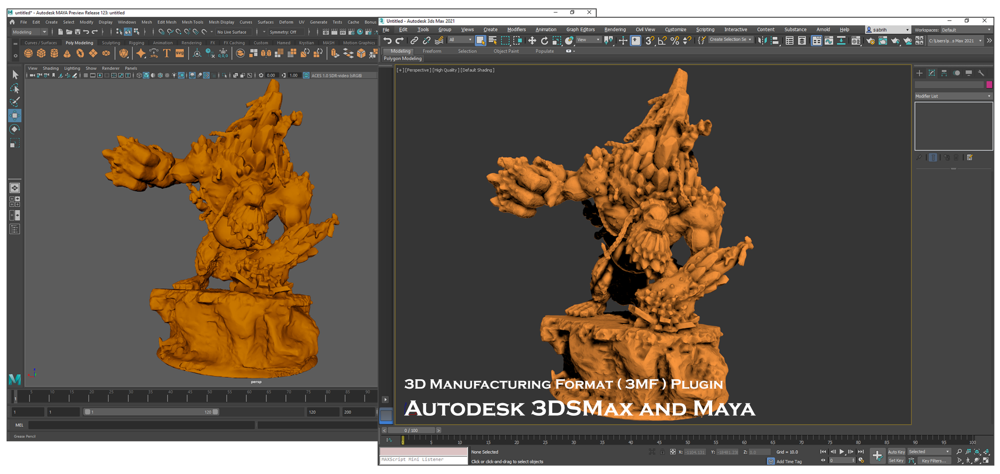
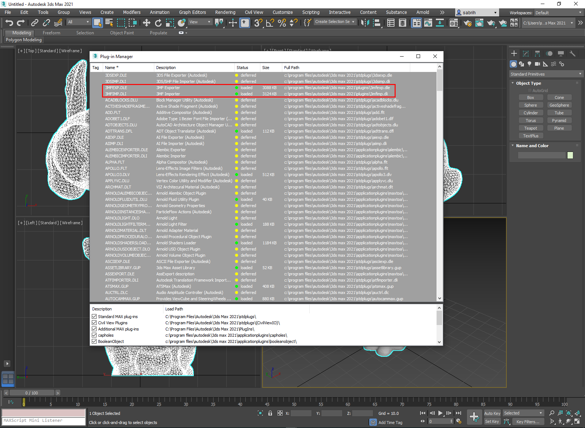
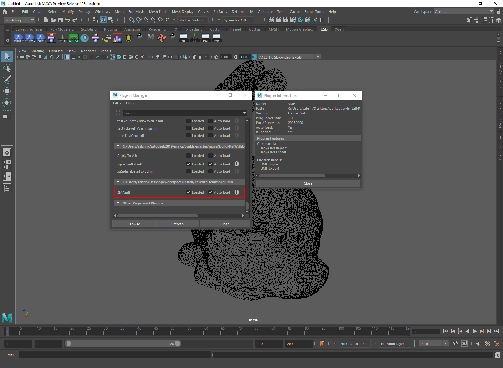

 

## What is M3MF?

An open-source Autodesk 3DSMax & Maya plugin for importing and exporting 3MF file format. Written in C++. 

## How to Load 3MF Plugin in 3DSMax

Copy both `3MFIMP.dli`, `3MFEXP.dle` from install directory to `<location_3dsmax_installed>\Plugins` directory. 
Next time you run 3DSMax, both importer and exporter plugins will show up in Plug-in Manager.

 

***NOTE:*** See "Build Documentation" section below for more information about install directory.

## How to Load 3MF Plugin in Maya 

The provided module file (*.mod) facilitates setting various environment variables for plugins and libraries. After the project is successfully built, ```M3MF.mod``` is installed inside the install directory. In order for Maya to discover this mod file, ```MAYA_MODULE_PATH``` environment variable needs to be set to point to the location where the mod file is installed. 

```
e.g
Windows: 
set MAYA_MODULE_PATH=C:\workspace\install\RelWithDebInfo\Maya

Linux or MacOS: 
export MAYA_MODULE_PATH=/usr/local/workspace/install/RelWithDebInfo/Maya
```
Once `MAYA_MODULE_PATH` is set, run maya and go to ```Windows -> Setting/Preferences -> Plug-in Manager``` to load the plugins.

 

## Mesh Topology 

3MF only supports triangle to represent a single face of the mesh. See 3MF specification on Triangles

https://github.com/3MFConsortium/spec_core/blob/1.2.3/3MF%20Core%20Specification.md#414-triangles

There are many ways to triangulate a mesh in 3DSMax. The easiest way is to make sure that you are always in "Editable Mesh" when exporting your mesh for 3MF format. "Editable Poly" is currently not supported.

In Maya, make sure to "triangulate" your mesh before exporting to 3MF format.

## Build Documentation

+ [Build Docs](docs/build.md)